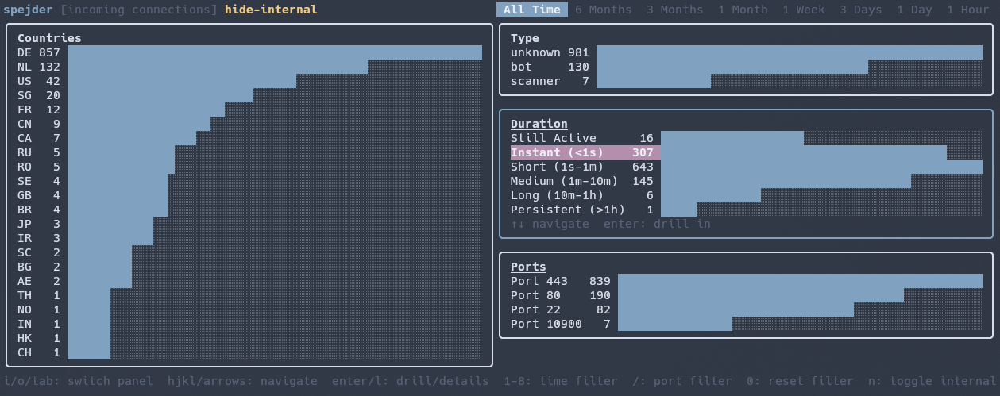

# spejder 🔍

**spejder** is a lightweight, real-time eBPF-powered network connection monitor and TUI dashboard for Linux. It tracks incoming TCP connections, aggregates GeoIP details (country, city, ASN), and profiles traffic type, port activity, and connection durations.



---

## Features

- **eBPF-based Tracking:** Low-overhead TCP connection tracking (`SYN_RECV`, `SYN_SENT`, and `TCP_CLOSE` states) directly from the Linux kernel.
- **GeoIP Resolution:** Automatically maps IPs to Country, City, ASN, and ISP.
- **Multidimensional Dashboard:**
  - Left panel: **Countries** list with full drill-down flow (Countries ➔ Cities ➔ ASNs ➔ IP List).
  - Right panels: **Traffic Type**, **Connection Durations**, and targeted **Ports**.
- **Interactive Drill-down:** Hit `Enter` or `l` on any panel item to filter down step-by-step to the exact IP addresses, connection reasons, and durations.
- **PTR Lookup:** Reverse DNS lookup integrated in the connection details view.
- **Smart Filtering:** Port filter inputs (`/`) and internal connections toggle (`n`) to filter out local traffic.

---

## Installation & Setup

### 1. MaxMind GeoIP Database Configuration
`spejder` requires MaxMind's GeoLite2 databases for IP geolocation.
1. Sign up for a free account at [MaxMind](https://www.maxmind.com/).
2. Copy `GeoIP.conf.example` to `GeoIP.conf`:
   ```bash
   cp GeoIP.conf.example GeoIP.conf
   ```
3. Insert your `AccountID` and `LicenseKey` into `GeoIP.conf`.
4. Run the setup command to download the MMDB databases into `assets/geo/`:
   ```bash
   just setup
   ```

---

### 2. Local Development (Nix / Go)

If you are using Nix, a development shell with all dependencies (eBPF headers, Clang, Go, just) is provided.

1. **Enter the devshell:**
   ```bash
   nix develop
   ```
2. **Build everything:**
   ```bash
   just build
   ```
3. **Run the tracking daemon (requires root/sudo for eBPF):**
   ```bash
   just run
   ```
4. **Start the TUI dashboard:**
   ```bash
   ./spejder -db spejder.db
   # or with just:
   just run-tui
   ```

---

### 3. NixOS Deployment (Systemd Module)

`spejder` ships with a native NixOS module that handles running the daemon as a systemd service, auto-creating the SQLite database in `/var/lib/spejder/spejder.db`, and scheduling weekly GeoIP updates.

Add the following to your NixOS configuration (e.g., `flake.nix` or system imports):

```nix
{
  # 1. Enable the module
  services.spejder = {
    enable = true;

    # Enable automatic weekly updates of the GeoIP database
    geoip = {
      enable = true;
      configFile = "/run/secrets/geoip.conf"; # Path to GeoIP.conf outside Nix store
    };

    # Add users permitted to read the Spejder SQLite database to the group
    readers = [ "username" ];
  };
}
```

Rebuild your system:
```bash
sudo nixos-rebuild switch --flake .#your-host
```

Once installed, any user in the `readers` list can simply start the TUI globally from anywhere:
```bash
spejder
```

---

## Keyboard Controls

| Key | Action |
|-----|--------|
| `o` / `Tab` | Switch to the next panel (cycle clockwise) |
| `i` | Switch to the previous panel (cycle counter-clockwise) |
| `j` / `k` / `Arrows` | Scroll down / up |
| `l` / `Right` / `Enter` | Drill down to next level (or open IP details modal at leaf level) |
| `h` / `Left` / `Backspace` | Go back one level |
| `1` - `8` | Change time filter window (All Time, 6 Months, ..., 1 Hour) |
| `/` | Input port filter (e.g. filter for port `22` only) |
| `0` | Clear port filter |
| `n` | Toggle visibility of internal / local connections (`traffic_type = 'internal'`) |
| `q` / `Ctrl+C` | Quit |
| `Esc` | Close IP details overlay / cancel port filter entry |
